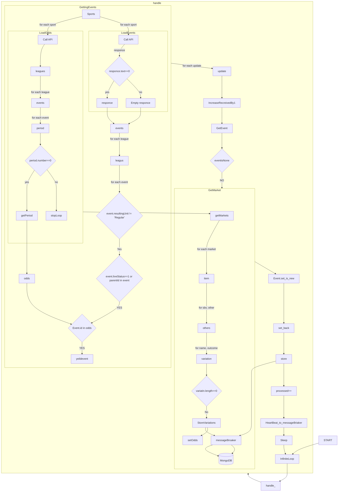

docke# ApiParser

Parsers collect data from a data source (which may be API requests or socket connections) and parses that data into a meaningful format (events) that are ready to use.Each bookmaker has its own parser.Each bookmaker/parser has a unique technique for capturing data and parsing it, however there are certain similarities.

Each bookmaker is associated with some sport ids and the parser loads odds and events for each sport id linked with it.They will store events that are generated by marketplaces and events.Finally, the parser parses input with specific time intervals.

In another way, socket parsers work similarly to api parsers. It takes a snapshot of all the data, logs it, and invokes functions that deal with the events we get.This parses the essential data and generates a unique format for storage.We also utilize Redis to get past odds so that we can preserve only the fresh ones and avoid duplicates in the historical odds.Parsers detect variances among updates and treat each variation as an event.

We also have telegram and mail services for receiving vital information for parsing system updates.

## Get Updates

    def get_updates(self, sport: str) -> list:

This function will call the API for each sport we use. If there is some error in the API, after third attempt it sends a
Telegram message informing us that something is wrong, otherwise, it returns a list of objects that we will parse later
or an empty list.

- sport: The sport for which we are calling the API.

## Process Update

    def process_update(self, update: dict, last_update: datetime) -> Union[None, Event]:

This function parses the required data and creates an Event object If necessary - we can set the percentage below we
will not accept the changes, as there will be a lot of calculations for the weighted average system unnecessarily.

- event: This is the update we parse.
- last_update: Datetime

---

### Tech Stack
- > MongoDB - `Database to store events and odds`
-  > Redis - `A Cache System to store events and odds in In-memory database`
- > Kafka - `A message broker to handle events`
- > Flask - `A framework to design to apis`
- > Docker - `Centralized system  to run container ( Mongo,kafka, redis and this project images(Dockerfile)) in docker compose ( docker-compose.yml)`
- > requests - `python requests library is used to perform rest methods such as GET, POST etc.,`
- > Telegram bot - `Telegram api/ bot is used to poll/ update error in system to telegram chat/ channel via telegram bots ( Through pure telegram api - without any other frameworks such as Pyrogram)` 
- >  Catch - `A universal catch function to handle errors in system`
---

#### Sample Odds `Pinnacle Flow`:- 
        {
        "sportId": 29,
        "last": 1446001711,
        "leagues": [
            {
                "id": 2476,
                "events": [
                    {
                        "id": 1395657493,
                        "periods": [
                            {
                                "lineId": 1445899378,
                                "number": 0,
                                "cutoff": "2021-09-19T11:00:00Z",
                                "maxSpread": 225,
                                "maxMoneyline": 225,
                                "maxTotal": 100,
                                "maxTeamTotal": 50,
                                "status": 1,
                                "spreadUpdatedAt": "2021-09-13T11:18:10.497Z",
                                "moneylineUpdatedAt": "2021-09-13T11:18:10.497Z",
                                "totalUpdatedAt": "2021-09-13T11:18:10.497Z",
                                "teamTotalUpdatedAt": "2021-09-13T11:18:10.497Z",
                                "spreads": [
                                    {
                                        "hdp": 0.25,
                                        "home": 1.787,
                                        "away": 2.09
                                    },

#### Sample Fixtures `Pinnacle Flow` :- 

        {
        "sportId": 29,
        "last": 360359083,
        "league": [
            {
                "id": 2476,
                "name": "Sweden - Superettan",
                "events": [
                    {
                        "id": 1395657493,
                        "starts": "2021-09-19T11:00:00Z",
                        "home": "Akropolis IF",
                        "away": "Vasteras SK",
                        "rotNum": "5665",
                        "liveStatus": 0,
                        "status": "O",
                        "parlayRestriction": 2,
                        "altTeaser": false,
                        "resultingUnit": "Regular",
                        "version": 359417609
                    }

---
### Handle
    def handle(self):
    
        
 - This function goes through events, calls functions to process them and later stores.
 - Getting updates from get_all_events Building event object from update with get_event method If event is not None, then get odds of it Update event is_new or not 
 - Update odds of event as back and stores it in Store

### Getting Events 
    def get_all_events(self) -> Generator:
        
  - Callins the API to collect data of event changes
  - Loading odds and events for every sport in sports 
  - For every event in Events, skipping event if is not live or resultingUnit is not Regular 
  - Building dict representation of event and yielding it 
  - Examples
    - > sports   =`{29: 1, 4: 2, 33: 5}`
    - > Sample Event=`{'sport_id': 29, 'league_id': 2476, 'league_name': 'Sweden - Superettan', 'event_id': 1395657493, 'parent_id': None, 'start_date': '2021-09-19T11:00:00Z', 'home_name': 'Akropolis IF', 'away_name': 'Vasteras SK', 'live_status': 0, 'status': True, 'markets': {'1X2': {...}, 'O/U': {...}, 'BTTS': {}}}`

### Load Odds

    def _load_odds(self, sport_id):
 - Calling an API for the attached sport and getting odds for events that match the filter.

 - Query with api (/odds) with sportId, oddsFormat (“Decimal”) and isLive values - See above Sample odds for schema 
 - Get a period where the number is 0 which is inside events which are also inside in leagues.
 - Make a new ticket which consists of events ids as keys and period as value and return it 
### Period:-
    def _period(self, doc: dict, sport_id: int) -> dict:
  
 - Get market by sportId  `{'1X2': {}, 'O/U': {}, 'BTTS': {}})`
 - Status is True if status of event/period  is 1 otherwise false.
 - Return parsed market(tmp) by *_moneyline, _totals, _spreads.*
  
### Load Events
    def _load_events(self, sport_id: int, event_ids: List[str]):
        
        

- Calling an API for the attached sport and getting fixtures for events that match the filter.
 - Query fixtures(endpoint:- /fixtures?) with sportId and isLive
 - Decode response to dict/json format and return it
### Get Event

    def _load_events(self, sport_id: int, event_ids: List[str]):
            
            
- Calling an API for the attached sport and getting fixtures for events that match the filter.
 - This method builds uniquely  Event Object which can be stored in datastore from from event which is in dict/json format
### Get Market

    def get_market(self, event: Event, markets: dict) -> [bool, dict]:
 - Loads current Odds from redis datastore as this event key as redis hash key
- If not found in redis then it considered as new one (Event)
- Make a new Variations(Python buildIn list class implementation with serialize method which dumps it elements  into json ) object 
- Get Variation Object from event Information. And append it to Variations and object and return it 
---
#### Sample Event from Pinnacle Parser

---
> #### Flow representation

